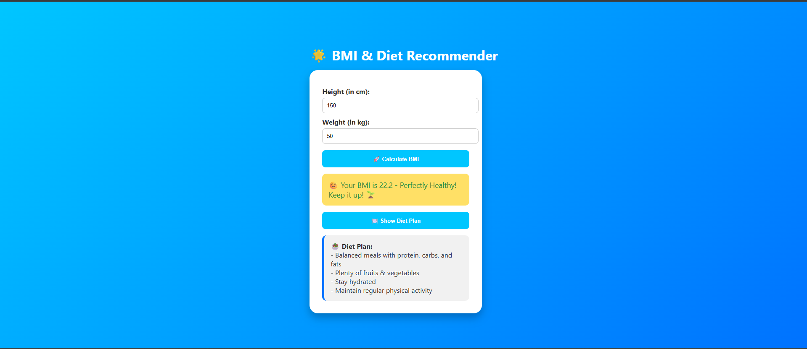

# 🌟 BMI & Diet Recommendation Web App

An interactive, fun, and modern **BMI Calculator & Diet Recommendation** web app built using **HTML, CSS, and JavaScript** — no frameworks, no backend!

---

## 🚀 Features

- 📏 Calculates BMI from height and weight
- 🎯 Shows personalized BMI category (Underweight, Healthy, Overweight, Obese)
- 🍽️ Provides diet suggestions based on BMI
- 🌈 Stylish UI with gradient backgrounds and emoji feedback
- 💡 All frontend — no backend required

---

## 🛠️ Tech Stack

- HTML5
- CSS3
- JavaScript (Vanilla)

---

## 📁 Folder Structure

bmi-diet-recommender/
├── index.html # Main HTML file
├── style.css # CSS styling
├── script.js # JS logic for BMI and diet

## 👩‍💻 Author

**Varshini Yerlanki**  
B.Tech CSE, VIT (2022–2026)  
University 3rd Rank Holder  
📧 yerlankivarshini@gmail.comw 
🔗 [LinkedIn](https://www.linkedin.com/in/varshini-yerlanki-a95698293) | [GitHub](https://github.com/Varshini-966)

